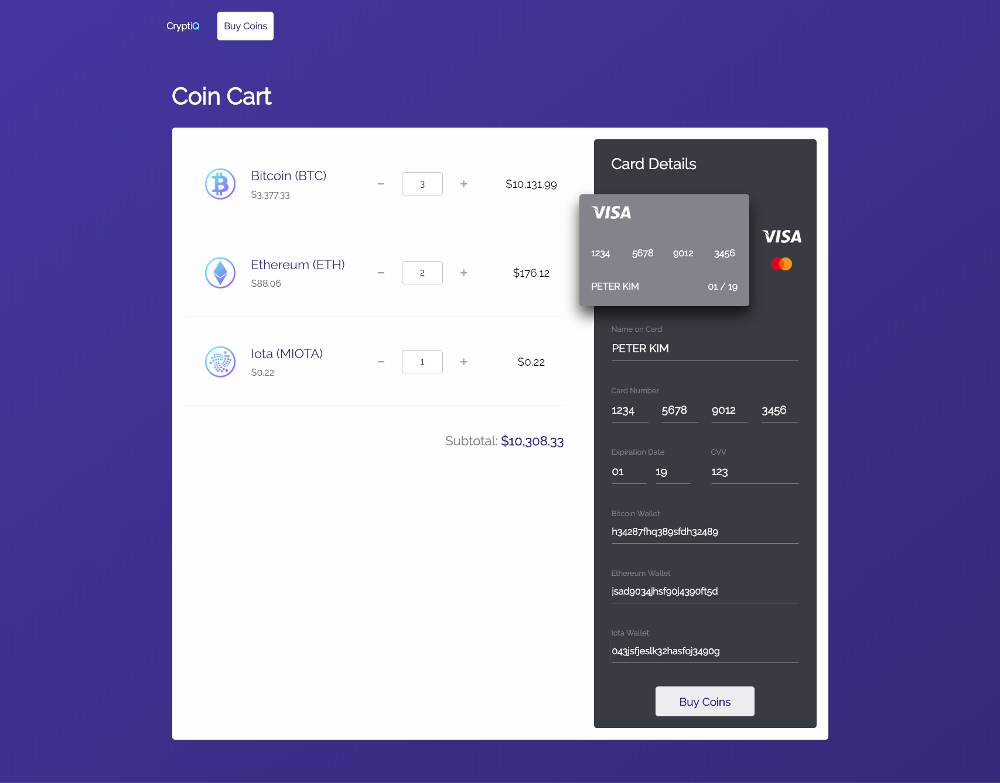

# CryptiQ
### Introduction
CryptiQ is a (mock) cryptocurrency e-commerce platform that takes the user through an intuitive and unequivocal process of purchasing Bitcoin, Ethereum, and Iota. 




## Getting Started
### Installing
Clone the repository and download dependencies.
```
$ git clone https://github.com/peter-minho-kim/cryptiq.git
$ cd cryptiq
$ npm install
```

### Launching
Start the development server.
```
$ npm run dev-server
```
This will automatically open a new browser window with the project.

## Built With
 - [Brave New Coin API](https://bravenewcoin.com/developers)
 - [CSS3](https://developer.mozilla.org/en-US/docs/Web/CSS/CSS3)
 - [React](https://reactjs.org/)
 - [Redux](https://redux.js.org/)
 - [Moment.js](https://momentjs.com/)
 - [Webpack](https://webpack.js.org/)

## License
This project is licensed under the MIT License.

## Acknowledgments
### Code
- [Fade in Animations](http://animista.net)

### Images
- [Best](https://thenounproject.com/search/?q=best&creator=1145943&i=1899025)
- [Bitcoin](https://thenounproject.com/search/?q=bitcoin&creator=2128292&i=813130)
- [Check](https://thenounproject.com/term/check/2080802/)
- [Circle](https://thenounproject.com/search/?q=circle&creator=2634750&i=1191361)
- [Ethereum](https://thenounproject.com/search/?q=ethereum&creator=610855&i=1547155)
- [Payment](https://thenounproject.com/search/?q=credit%20card&creator=2169778&i=1331538)
- [Receive Bitcoin](https://thenounproject.com/search/?q=bitcoin&creator=2344303&i=1521044)
- [Umbrella](https://thenounproject.com/search/?q=umbrella&creator=1555968&i=1707538)
- [Vault](https://thenounproject.com/search/?q=vault&creator=2976159&i=1492890)